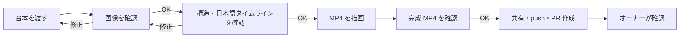

# aka-movie メンバー向けセットアップ・利用手順書

この手順書は、初めて参加するメンバーが GitHub への参加から動画の共有プルリクエスト作成までを完了するためのものです。動画は Codex のローカル機能で作成し、OpenAI API キーや Web アプリの設定は使いません。

> [!IMPORTANT]
> このリポジトリでは、メンバーは `leran_rule/` を作成・編集・承認しません。改善点は共有動画の `review-request.md` に事実と意図だけを記録します。動画をオーナーが承認した後、Codex が学習案を提示し、オーナーが明示的に承認した内容だけを正式ルールにします。

## Codex に頼めること・自動ではないこと

| 作業 | 動画作成スキルだけで自動実行されるか | Codex に頼んだ場合 |
| --- | --- | --- |
| clone・初回セットアップ | いいえ | 実行できます。GitHub ログインや実行許可は本人が承認します。 |
| 個人ブランチの作成 | はい。project ID と同じ `video/<project-id>` を作成して切り替えます。 | 作成後にブランチ名を確認するだけです。 |
| 画像・構造・アニメーションの作成 | はい。固定パターンを選ばず、台本の意味に合わせて動きを組み合わせます。 | 構図の希望は台本の次に書き、日本語のタイムラインを確認します。 |
| 共有用 MP4 の準備 | はい。完成 MP4 の `OK` 後に自動で行います。 | project ID を指定して頼む必要はありません。 |
| commit・push・PR 作成 | はい。完成 MP4 の `OK` 後に自動で行います。 | GitHub のログインや実行許可だけは本人が承認します。 |

## 1. このプロジェクトでできること

- 日本語の台本から、図解を段階的に表示する MP4 動画を作成します。
- 作成途中の画像、構造、日本語で説明されたアニメーションの流れを確認し、それぞれ問題なければ `OK` と返します。
- アニメーションは、移動・拡大・回転・透明度・線の描画・緩急を台本に合わせて毎回組み合わせます。
- 完成した動画だけを GitHub に共有します。作業途中の画像、台本、元の出力は公開しません。

| 役割 | 担当すること | 担当しないこと |
| --- | --- | --- |
| メンバー | 動画作成、共有用 MP4 の準備、個人ブランチでの PR 作成、レビュー待ちメモの記入 | `leran_rule/` の変更、ルールの候補化・承認・昇格 |
| オーナー | メンバー招待、PR 確認、動画承認後の学習案確認、ルールの明示承認と更新 | メンバーにルール更新を委任すること |

## 2. 事前準備

次を用意してください。

1. オーナーから届く GitHub の招待を受け入れます。権限は **Write** を想定しています。
2. Windows に Git for Windows、Git LFS、Node.js の LTS 版、Codex デスクトップアプリを導入します。
3. ターミナルを開き、次のコマンドが動くことを確認します。

```powershell
git --version
git lfs version
node --version
npm --version
```

> [!NOTE]
> GitHub の ruleset 設定やメンバー招待はオーナーが行います。メンバーは設定を変更する必要はありません。

## 3. 初回セットアップ

PowerShell で次を順番に実行します。

```powershell
git lfs install
git clone https://github.com/kyomu-movie/aka-movie.git
cd aka-movie
npm.cmd install
npm.cmd run codex:install-skill
```

最後のコマンドが完了したら、Codex を完全に再起動します。再起動後、このリポジトリを Codex で開きます。

### 個人ブランチは自動で作られる

動画ごとに個人ブランチを作り、`main` には直接 push しません。

`$movie-create` は project ID を作ると同時に、同じ名前の `video/<project-id>` ブランチを作成して切り替えます。たとえば project ID が `260712_01` なら、ブランチは `video/260712_01` です。

```powershell
git branch --show-current
```

表示された名前が `video/<project-id>` なら、そのまま動画を作成します。違う名前なら作業を止め、オーナーへ共有してください。

## 4. Codex で動画を作る

Codex のチャットで、`$movie-create` を指定して台本を渡します。例:

```text
$movie-create を使って、次の台本から動画を作成してください。

台本:
（ここに台本を貼り付けます）

構図・デザインの希望:
（例: 左から右へ流れる構図。赤い矢印を使う。）
```

構図の希望がない場合は、`構図・デザインの希望` の行を削除します。Codex は承認済みルールをテンプレート一覧として選ぶのではなく、品質基準と参考例として使います。台本を意味のまとまりに分け、内容に合う移動・拡大・回転・透明度・線の描画・緩急を安全な範囲で毎回組み合わせます。動画作成は次の流れです。



1. Codex が `export/<project-id>/` に作業フォルダを作成します。
2. **画像**が表示されたら、構図、文字、色、矢印を確認します。問題なければ明確に `OK` と返し、修正が必要なら内容を具体的に伝えます。
3. 次に **構造**（タイトル、関係線、ノード、注釈の内容と順番）を確認します。新しい矢印や曲線には、それぞれの経路が設定されます。
4. Codex がアニメーション設定を自動検査し、「0〜1秒: タイトルを小さく拡大しながら表示」のような **日本語タイムライン**を示します。生の JSON を読む必要はありません。順番、強調、速さが問題なければ `OK` と返します。
5. 描画後に、1920×1080、30fps、無音の H.264 MP4 が作成されます。完成動画を確認し、問題なければもう一度 `OK` と返します。
6. この最後の `OK` の後、Codex が共有用 MP4 の準備、個人ブランチへの push、ドラフト PR の作成まで自動で行います。

> [!CAUTION]
> `OK` はその段階の内容を確定する合図です。迷う場合は `OK` を返さず、修正内容を伝えてください。

## 5. 完成動画の `OK` で GitHub に共有する

描画後に完成 MP4 を確認します。問題なければ `OK` と返すだけで、共有用ファイルの準備から GitHub への push、ドラフト PR の作成まで進みます。project ID を書いた追加メッセージは不要です。

この処理は、`export/260712_01/260712_01.mp4` を次の「完了動画共有フォルダ」へコピーします。

```text
shared-videos/260712_01/
├── 260712_01.mp4
├── metadata.json
├── animation-summary.json
└── review-request.md
```

- `export/` はローカル専用です。Git に追加しません。
- `shared-videos/` の MP4 は Git LFS で管理されます。
- `metadata.json` は共有時点のファイル情報です。通常は編集しません。
- `animation-summary.json` は、表示順、時間、使用した動きだけを記録します。台本、画像、表示文字は入りません。

### レビュー待ちメモを書く

`shared-videos/<project-id>/review-request.md` を開き、必要な場合だけ次を記入します。

- 何を変更したか、または何に気付いたか
- なぜ将来の動画でも重要かもしれないか

ここに書くのはレビュー待ちメモであり、ルールではありません。`leran_rule/` のファイルを作成・編集・移動しないでください。

## 6. GitHub の認証だけ本人が行う

最後の `OK` の後、Codex は `shared-videos/<project-id>/` だけを commit・push し、ドラフト PR を作成します。ほかのファイルや `leran_rule/` は公開しません。

GitHub のログイン画面や実行許可が表示されたときだけ、本人が承認します。作成後、Codex が PR のリンクを表示します。

`main` へのマージは ruleset とレビューの手順に従います。push が拒否されたときに、force push や `main` への直接 push を行わないでください。

## 7. ルールの扱い

次のフォルダはオーナー専用です。

```text
leran_rule/approved/
leran_rule/candidates/
leran_rule/successes/
```

メンバーは、動画の共有とレビュー待ちメモまでを担当します。学習は次の順で行います。

1. メンバーが完成動画へ `OK` を返し、動画のドラフト PR を作成します。
2. オーナーが動画、`review-request.md`、`animation-summary.json` を確認します。
3. オーナーが動画を承認すると、Codex が再利用できそうな学習案を画面に提示します。この時点ではファイルを変更しません。
4. オーナーが学習案を明示的に承認した場合だけ、Codex が `approved/` と `successes/` を更新します。公開前にも変更ファイルを表示し、オーナーの承認を受けます。

これはモデル自体の追加学習ではありません。承認された文章ルールと成功記録を、次回の Codex が品質基準と参考例として読みます。

## 8. 困ったとき

| 状況 | 確認・対処 |
| --- | --- |
| `git lfs` が見つからない | Git LFS をインストールし、PowerShell を開き直して `git lfs install` を実行します。 |
| `npm.cmd` または `node` が見つからない | Node.js の LTS 版を導入し、PowerShell を開き直します。 |
| `$movie-create` が表示されない | `npm.cmd run codex:install-skill` が成功したことを確認し、Codex を完全に再起動します。 |
| `codex:share` が MP4 を見つけられない | 動画の描画が完了していること、project ID が `260712_01` のような形式であることを確認します。 |
| アニメーション検査で止まった | Codex に表示されたエラーをそのまま渡します。要素、時間、曲線経路、安全範囲を Codex が修正して再検査します。 |
| push が拒否された | `main` ではなく個人ブランチにいることを確認します。force push はせず、表示されたエラーをオーナーへ共有します。 |
| ルールを変えたくなった | `leran_rule/` は編集せず、共有動画の `review-request.md` に事実と意図だけを記入します。 |

## 9. 完了チェックリスト

- [ ] GitHub の招待を受け入れ、`video/<project-id>` の自動作成を確認した
- [ ] Git LFS、Node.js、Codex を準備した
- [ ] `$movie-create` で画像・構造・日本語タイムラインを確認し、必要な段階で `OK` を返した
- [ ] 完成 MP4 を確認し、問題ないことを示す最後の `OK` を返した
- [ ] `shared-videos/<project-id>/` に MP4、メタデータ、アニメーション要約、確認メモだけが自動共有された
- [ ] `review-request.md` に必要な事実と意図だけを記入した
- [ ] 個人ブランチから PR を作成した
- [ ] `leran_rule/` を変更していない

## 関連資料

- [GitHub 公開・保護設定](../GITHUB_SETUP.md) — オーナー向け
- [共有学習データの説明](../leran_rule/README.md) — ルールの扱い
